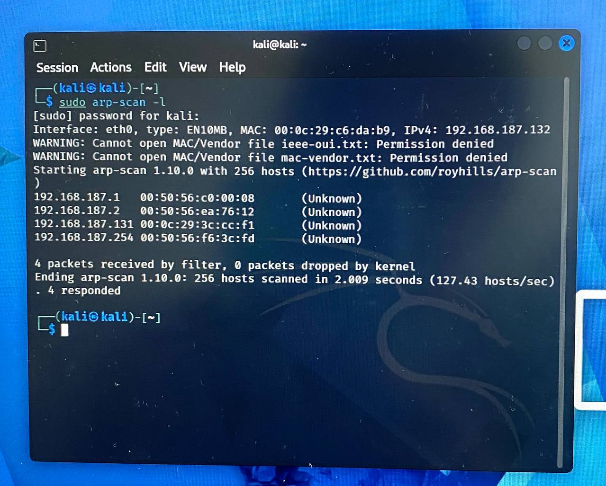
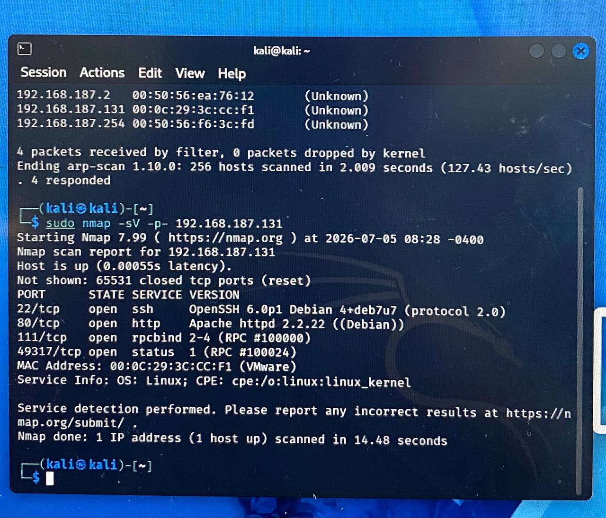
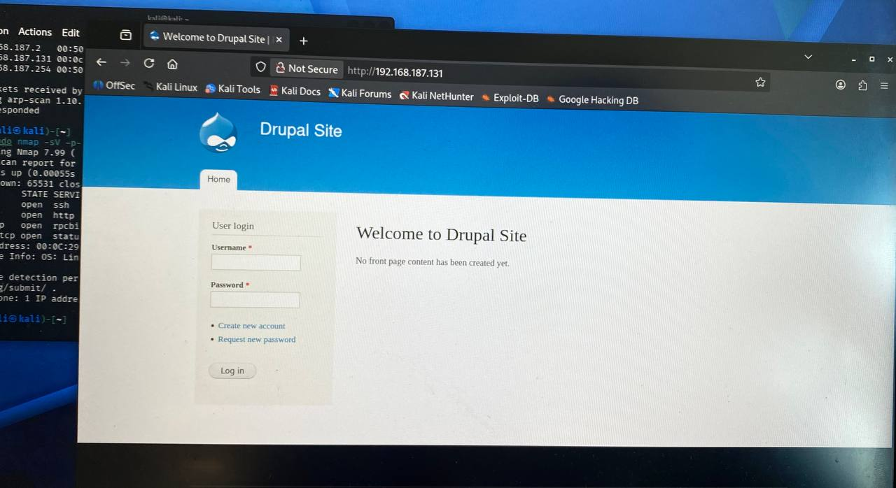
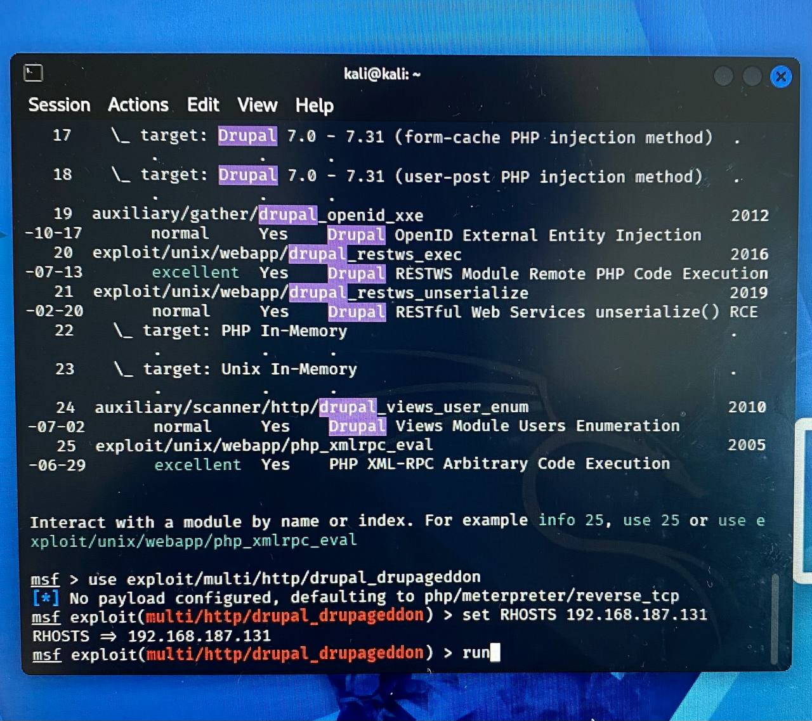
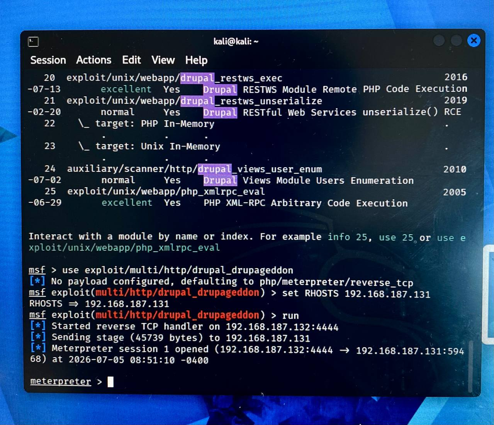
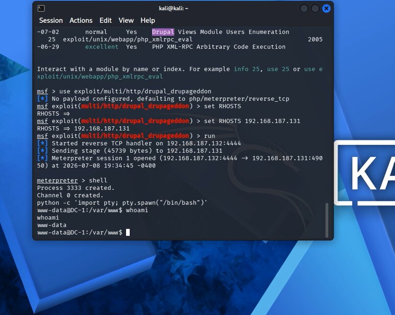
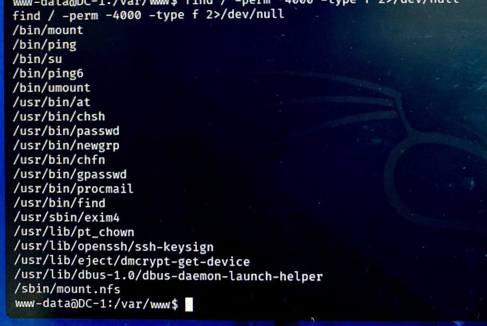
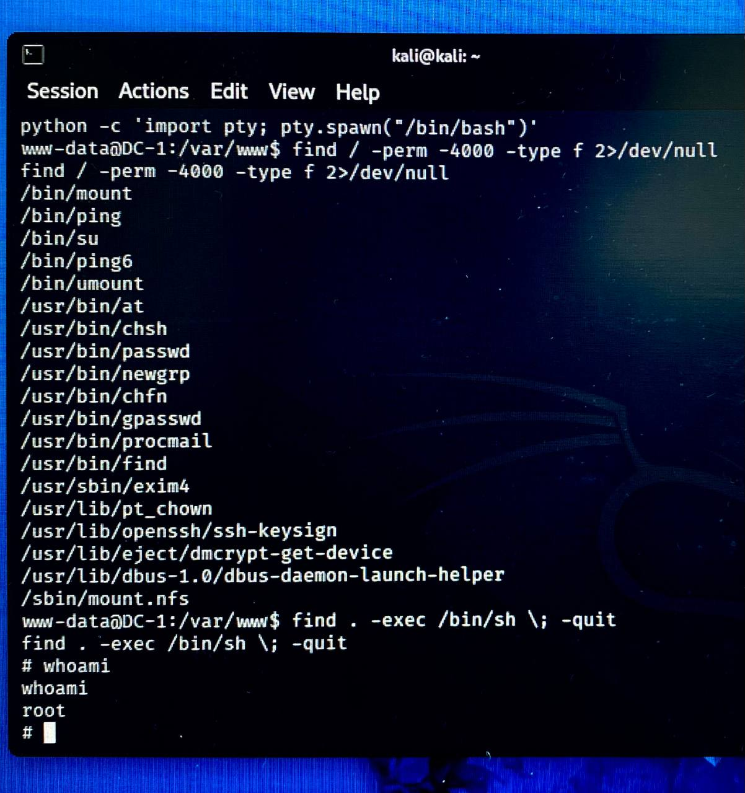

#  VulnHub DC-1 Walkthrough Demo
This report describes how I exploited DC-1 using Kali Linux. This is a Boot-to-Root challenge available on VulnHub. 
The main goal here is to gain initial access and escalate privileges to the root user to capture the final flag.
| Component | Details |
|-----------|---------|
| Target | VulnHub DC-1 |
| Attacker | Kali Linux |
| Hypervisor | VMware Workstation |
| Network | Custom NAT |
| Objective | Gain root access |

## Setup & Environment
Before starting the attack, I think it is useful to describe the lab environment. My goal was to create a realistic, yet completely isolated network to simulate an attack from within the LAN.
I used VMware to host both my attacker machine (Kali Linux) and the target (DC-1). To make sure the vulnerable machine couldn't access my actual home network (or the internet), I configured both VMs to communicate over a custom NAT network. This setup recreates a situation where a hacker has gained initial access to the internal network and is looking for their next target. 

## Attack Strategy (Roadmap)
Before starting the scanning and exploitation phases, let’s break down the four main phases of the attack:
1. **Network Discovery:** Scanning the local network to find the VM's IP address and see what ports are open.
2. **Vulnerability Assessment:** Analyzing the web service (Drupal) running on port 80 to find known bugs.
3. **Initial Access:** Using an exploit to get my first shell. At this point, I only have a normal, low-privileged user account
4. **Privilege Escalation:** Hunting for any misconfigurations in the Linux system to upgrade my access to the `root` user.


 
## Phase 1: Reconnaissance (Finding the Target)

For the first step, I needed to identify the IP address of the DC-1 machine. To find the target's IP, I used `arp-scan` on my local network to see who was online.
```bash
sudo arp-scan -l
```

After ignoring the other 3 IPs ( my own Kali machine and the VMware gateway), there was only one unknown IP left. This was my target.

After I found the IP, I started an `nmap` scan to see which services are running. I made sure to use the `-sV` flag because just knowing a port is open isn't very helpful; I needed to see the exact software versions to check for potential vulnerabilities.
```bash
sudo nmap -sV -p- 192.168.187.131
```

When the results came back, a few ports were open, but the most important one was port 80. It was running an Apache web server. Then I opened the web page in a browser and identified the application as Drupal 7.

## Phase 2: Initial Access (Exploiting Drupal)

Knowing the site was running Drupal 7, I searched for known vulnerabilities affecting that version and found the well-known Drupalgeddon SQL injection vulnerability (CVE-2014-3704). Because a public Metasploit module was available, I used it to exploit the target and obtain initial access.
Then I launched Metasploit:

```bash
msfconsole
```

Once inside, I searched for the Drupal exploit and selected the appropriate module:

```bash
search drupal
use exploit/multi/http/drupal_drupageddon
```
Next, I needed to configure the exploit parameters. I set the RHOSTS variable to my target's IP address and started the attack:

```bash
set RHOSTS 192.168.187.131
run
```

And after a few seconds, the exploit successfully executed, and I got a meterpreter > session providing initial access to the target.

To check the level of access, I opened a standard system shell and ran `whoami`. The output was www-data. 

This meant I had successfully broken into the web server, but I was only operating as a low-privileged service account. The next step was to find a way to get root access.
       
## Phase 3: Privilege Escalation (Achieving Root)

To elevate my privileges, I started checking the system for common Linux misconfigurations. A common technique in this phase is checking for SUID (Set Owner User ID) binaries. 

In Linux, if a file has the SUID bit set, it allows a normal user to execute that file with the permissions of the file's owner—which is often the `root` user. If the wrong program has this permission, it can be abused.

I used the following find command to search for SUID files, hiding any access errors: 

```bash
find / -perm -4000 -type f 2>/dev/null
```

Looking through the results, `/usr/bin/find` was suspicious because normally, `find` doesn't need root privileges, so seeing it here was a clear security flaw.
Since the find command supports the `-exec` option, I realized it could be used to spawn a shell.
 Because the SUID bit forces find to run as root, any shell it spawned would also inherit root privileges.
I executed the following command to bypass the restrictions:
 
```bash
find . -exec /bin/sh \; -quit
```

I ran `whoami` to verify, and the terminal returned root. The privilege escalation was successful, which means that I had full control over the target system.

## Conclusion & Remediation

Successfully rooting the DC-1 machine showed how combining two different vulnerabilities can lead to full system compromise. The whole attack relied on an outdated web application for initial access and a simple system misconfiguration for privilege escalation.

If this were a real-world server, fixing this machine would be fairly simple:
1.	**Update the CMS:** update the CMS to a supported version so the SQL injection flaw (Drupalgeddon) doesn't work anymore.
 
2. **Fix File Permissions:** The SUID bit must be removed from the `/usr/bin/find` binary. There is no reason for the `find` command to have root privileges. The admin should remove the unnecessary SUID permission by running 
```bash
chmod -s /usr/bin/find
```
Overall, this challenge was a useful exercise. It clearly showed how connecting external reconnaissance with internal privilege escalation can compromise a server, highlighting how important it is to keep web apps updated and system permissions locked down.


## References 

Below is the list of resources, references, and tools utilized to complete this walkthrough and format the final report:
* **[Hacking Articles Walkthrough](https://www.hackingarticles.in/dc-1-vulnhub-walkthrough/):** Used as a primary reference for the overall attack methodology and Drupal exploitation.
* **[Medium Write-up by Chikleet25](https://medium.com/@chikleet25/dc-1-vulnhub-walkthrough-878c94996a18):** Reviewed for comparing privilege escalation techniques.
* **Google Gemini & Grammarly:** Used only as assistants for understanding GitHub formatting, Docsify setup, and improving English grammar.
